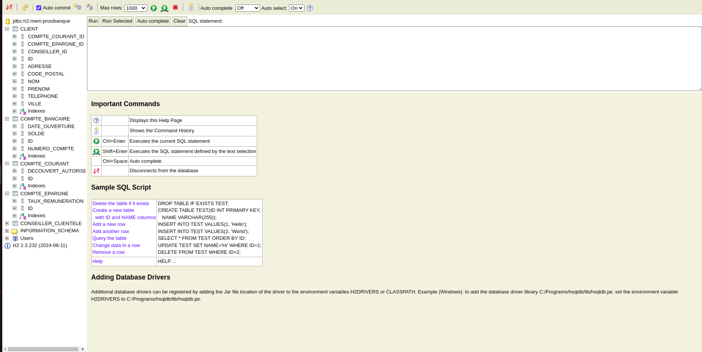
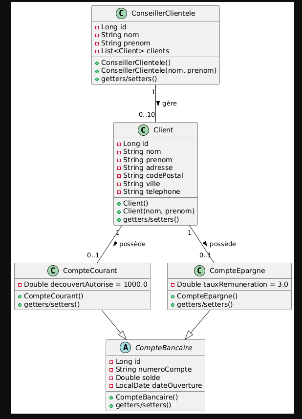

## Structure du projet
```
src/main/java/com/example/proxibanque/
├── entity/          Entités JPA (Client, CompteBancaire, ConseillerClientele)
├── repository/      Repositories pour l'accès aux données
├── service/         Logique métier
├── controller/      Contrôleurs REST
├── dto/             Objets de transfert de données
└── mapper/          Conversion entre entités et DTOs
```

### Accéder à la console H2


1. Démarrer l'application
2. Ouvrir un navigateur et aller sur : http://localhost:8080/h2-console
3. Utiliser les paramètres suivants :
```
JDBC URL: jdbc:h2:mem:proxibanque
Username: sa
Password: (laisser vide)
```

4. Cliquer sur "Connect"

### Consulter les données

Vous pouvez exécuter des requêtes SQL dans la console :
```sql
SELECT * FROM CLIENT;
SELECT * FROM CONSEILLER_CLIENTELE;
SELECT * FROM COMPTE_COURANT;
SELECT * FROM COMPTE_EPARGNE;
```

## API REST

### Endpoints disponibles

#### Clients

- GET /api/clients - Liste tous les clients
- POST /api/clients - Créer un nouveau client

#### Conseillers

- GET /api/conseillers - Liste tous les conseillers
- POST /api/conseillers - Créer un nouveau conseiller

## Modèle de données - ProxiBanque

Le diagramme ci-dessous présente la structure des entités du système ProxiBanque.




